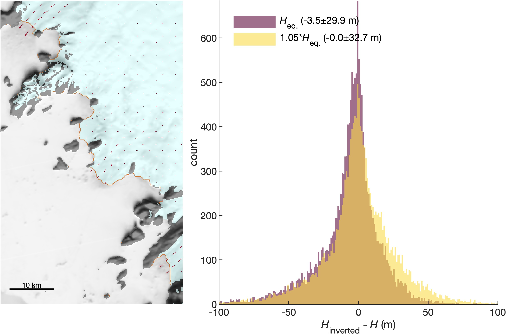
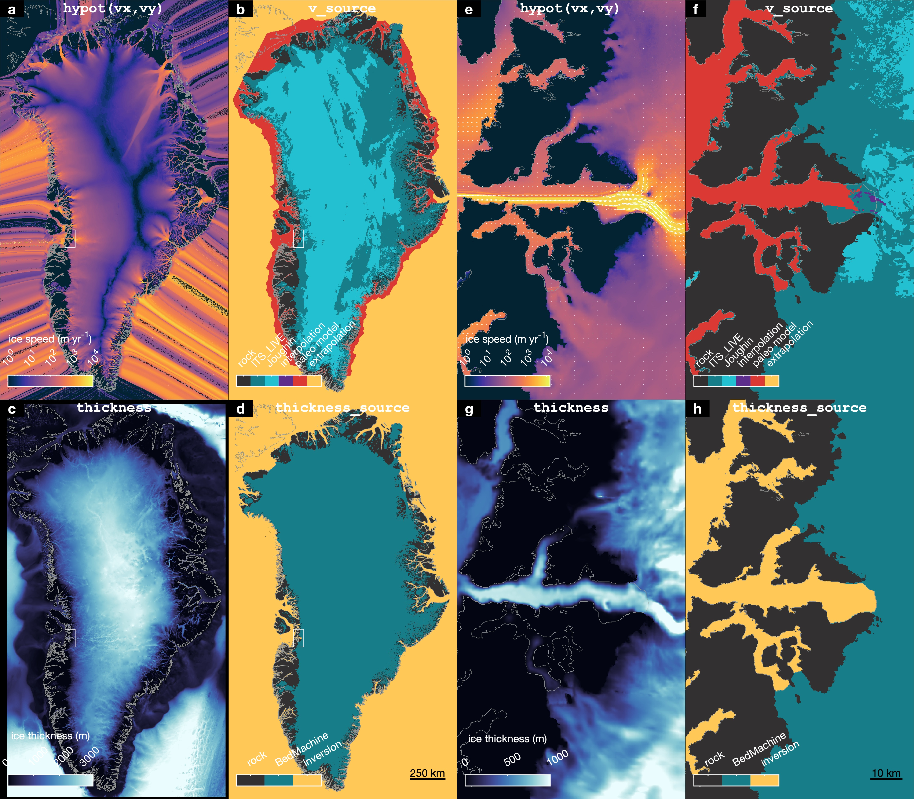
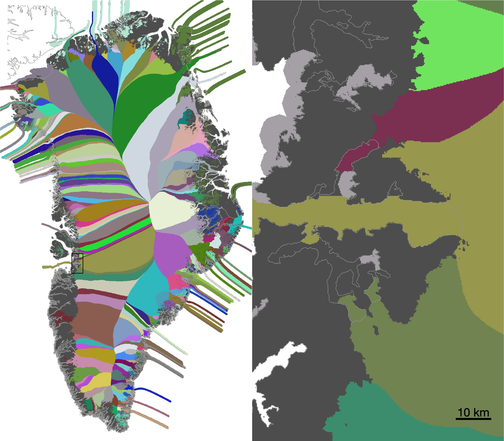
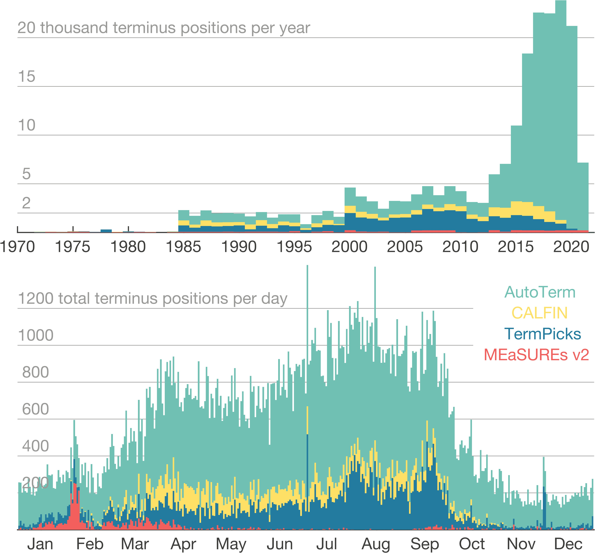
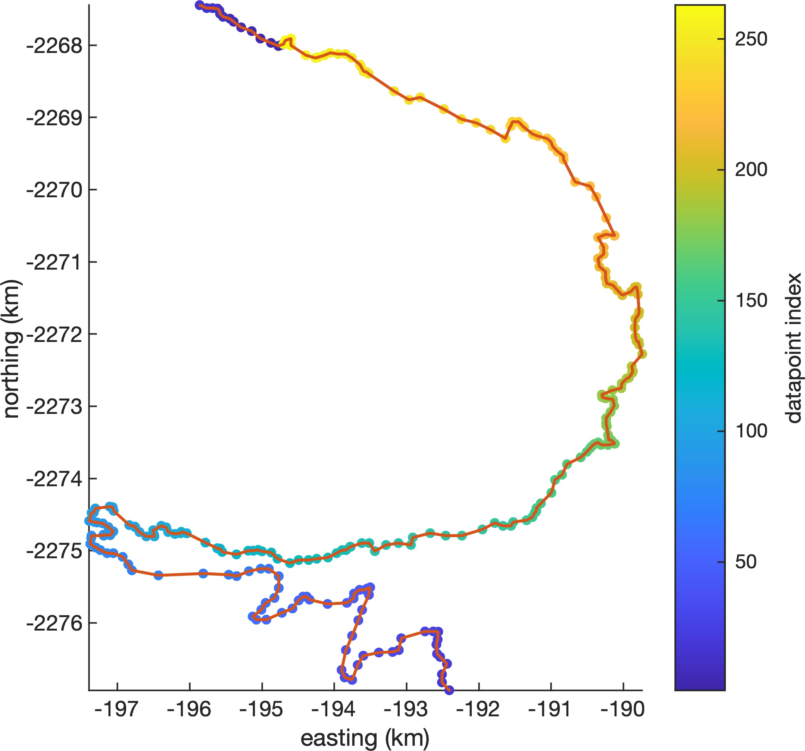
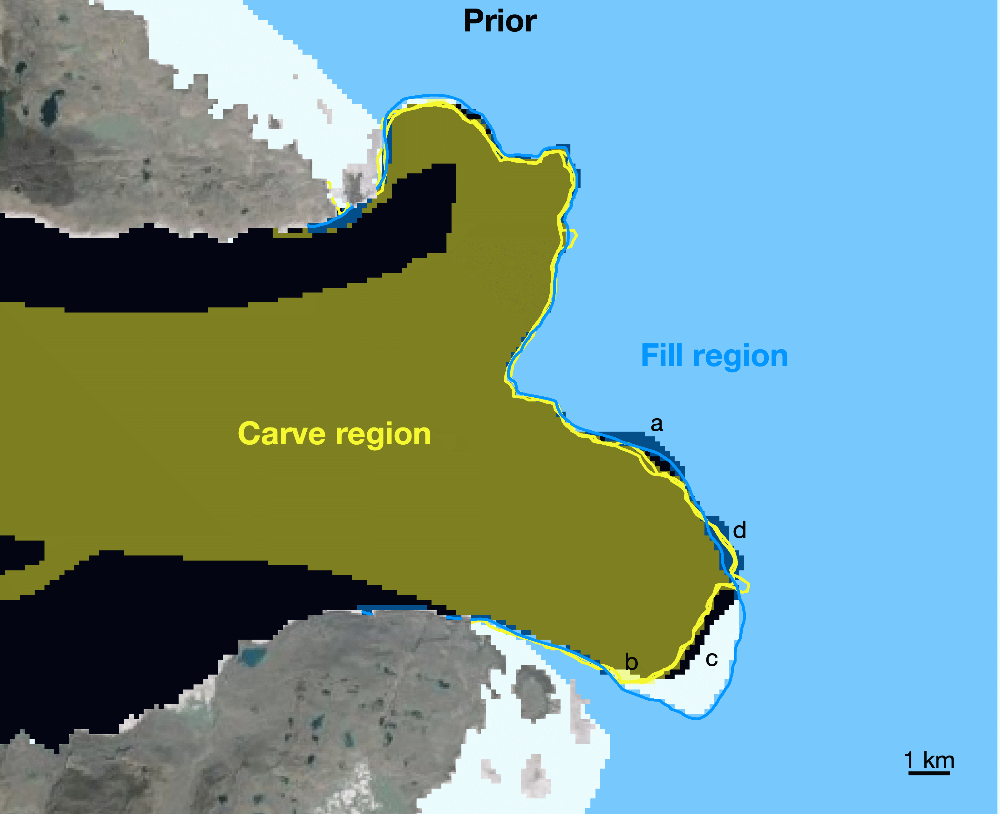

# Greenland monthly ice masks
MATLAB scripts to combine terminus picks into a consistent gridded ice mask.

# Contents 
* `animations` folder contains a few gifs. More animations 
* `code` folder contains all code necessary to create monthly ice masks, analyze the data, and create the figures published in our manuscript. 
* `data` folder contains final and intermediate data products. 
* `figures` folder contains all of the figures in our manuscript, plus a few figures that didn't make it into the manuscript. 

# Workflow 
1. **`thickness_inversion_uncertainty.m`** explores the uncertainty associated with inverting bed
elevations to solve for approximate thickness in fjords where ice no longer exists. In the map below, the edge of a semi-transparent blue ice sheet cuts diagonally across the image. Orange grid cells indicate locations where the BedMachine ice sheet edge is grounded below sea level and `errbed` is less than 100 m. For all such pixels around the ice sheet perimeter, we find that the BedMachine thickness is, on average, about 5% greater than Heq, the minimum thickness necessary for the ice to be grounded. When we invert BedMachine bed elevations to obtain hydrostatic-equilibrium thickness and multiply by 1.05, our inverted thickness matches BedMachine thickness within ±32.7 m. 
	

2. **`greenland_extrude_velocity_and_thickness_v2.m`** takes ITS\_LIVE v2 velocities, fills in missing data with paleo modeled velocities wherever possible, and then extrapolates beyond all measured and modeled extents to fill the entire domain. This script also extrapolates BedMachine v5 thickness in the direction of the extrapolated velocities. 
	* This script creates `greenland_extruded_velocity_and_thickness_2011-11-17.nc`.
	* Requirements: 
		* [Arctic Mapping Tools for MATLAB](https://github.com/chadagreene/arctic-mapping-tools), 
		* [BedMachine toolbox](https://github.com/chadagreene/BedMachine) with 
		* [BedMachine v5 data](https://nsidc.org/data/idbmg4/versions/5), 
		* [Climate Data Toolbox for MATLAB](https://github.com/chadagreene/CDT), 
		* [ITS\_LIVE v2 Greenland velocity mosaic](https://its-live-data.s3.amazonaws.com/mosaics/annual/v02/ITS_LIVE_velocity_120m_GRE_0000_v02.nc). 
	* Run `greenland_extruded_velocity_and_thickness_plotter.m` afterward to view the extruded velocity and thickness data, and make these: 
	

	

	

	
3. **`measures_terminuspicks_compiler.m`** compiles all annual shapefile data from *Joughin et al., 2021* into a single .mat file. Put all 49 years of shapefile data into a single folder then run this script. 
	* This script creates `measures_greenland_terminus_picks_v2.mat`.
	* Requirements:
		* MATLAB's Mapping Toolbox (for `shaperead`) and 
		* [MEaSUREs Annual Greenland Outlet Glacier Terminus Positions from SAR Mosaics, Version 2 shapefile data](https://nsidc.org/data/NSIDC-0642). 

4. **`autoterm_data_reformatter.m`** combines shapefile data from AutoTerm into a single .mat file, in a shapefile-like structure that's easy to combine with shapefiles from the other datasets. This script only saves data that meet certain error quality thresholds, which have already been defined on a per-glacier basis by manual inspection and can be found in `autoterm_error_thresholds.mat`. This script saves `autoterm_reformatted_trimmed.mat`. 

5. **`terminus_data_densifier.m`** reads in terminus position shapefiles from TermPicks ([*Goliber et al.*](https://doi.org/10.5194/tc-16-3215-2022)), CALFIN ([*Cheng et al.*](https://doi.org/10.5194/tc-15-1663-2021)), MEaSUREs v2 ([*Joughin et al.*](https://nsidc.org/data/nsidc-0642/versions/2)), and AutoTerm ([*Zhang et al.*](https://doi.org/10.5281/zenodo.7190740)). 
	* This script: 
	
		a. Compiles terminus position data from TermPicks ([*Goliber et al.*](https://doi.org/10.5194/tc-16-3215-2022)), CALFIN ([*Cheng et al.*](https://doi.org/10.5194/tc-15-1663-2021)), MEaSUREs v2 ([*Joughin et al.*](https://nsidc.org/data/nsidc-0642/versions/2)), and AutoTerm ([*Zhang et al.*](https://doi.org/10.5281/zenodo.7190740)). There is no terminus data in 1983. Here is the distribution of all the 63,473 terminus position picks:
			

		b. Densifies terminus position shapefiles to make about 5 points per grid cell width. Here's an example, which shows 263 datapoints in a two-segment piece of a TermPicks terminus position of Jakobshavn from March 3, 2005. The red dots are densified to 24 m spacing.
			

		c. Saves `terminus_data_densified_2022-11-14.mat`, which contains the densified terminus data as four simple columns of scattered data where `x` and `y` are polar stereographic meters, `t` is datenum, and `p` is a measure of data quality based on data sources and data quality flags, with highest numbers being the presumed best data.
		Here are a couple examples of the data created by `terminus_data_densifier.m`: 
		
 

	* Requirements: 
		* `export_fig` (can be easily replaced by MATLAB's built-in `exportgraphics` function). 
		* `measures_greenland_terminus_picks_v2.mat` created by `measures_terminuspicks_compiler.m` described above,
		* MATLAB's Mapping Toolbox (for `shaperead` and `polyjoin`),
		* [Climate Data Toolbox for MATLAB](https://github.com/chadagreene/CDT) for `subsubplot` and `hline` (can be replaced by built-in `subplot` and `yline`), 
		* [Arctic Mapping Tools for MATLAB](https://github.com/chadagreene/arctic-mapping-tools) for `psnpath`. 
		
6. **`greenland_termini_to_icemasks.m`** creates monthly masks from `terminus_data_densified.mat`.
	* This script loads densified terminus position data and gridded, extruded thickness & velocity data. 
	* The logic of the masking is as follows: 
		
		a. Start with a gridded coastline from `GimpOceanMask_90m_2015_v1.2.tif`, which is a mosaic mask with a mean date of August 2015.
		
		b. Starting with time posting 2015-08-15: Find all terminus positions observed 30 days or fewer *before* 2015-08-15. Artifically advect them forward in time to their expected positions on 2015-08-15 and carve from the ice sheet everything downstream of the advected positions, as we assume the ice sheet didn't suddenly grow at a rate much faster than its average velocity. 
		
		c. Find all terminus positions up to 30 days *after* 2015-08-15, artifically advect them upstream to their expected positions on 2015-08-15, and fill and set all pixels upstream of the advected terminus positions to `true`. 
			

			
		Steps b and c are shown above for August 15, 2015. The ice mask is shown in white, starting with a Prior mask taken from GIMP 2015. The blue lines show all terminus observations taken within 30 days after 2015-08-15, but they have been advected upstream (using the extruded velocity grid) to their expected location on 2015-08-15. **a.** All pixels upstream of the blue lines are in the "Fill Region" and are set as `true` in the ice mask. Terminus positions observed within 30 days before 2015-08-15 are advected downstream to their expected location on 2015-08-15 (shown in yellow) and **b.** pixels downstream of the yellow line defined as being in the "Carve region" and are set as `false` in the ice mask. **c.** No adjustments are made where the Prior mask terminus falls between the Carve region and the Fill region. This can occur when ice is lost to calving in the time between terminus observations, or it can be due to a mismatch in terminus position picks. **d.** We set ice pixels to `true` wherever downstream-advected and upstream-advected terminus positions overlap. 
			
		d. Use the adjusted mask created above as the basis for next month's ice mask and repeat steps b and c. Repeat until the last month of terminus position data. 
		
		e. Repeat step d, but going backward, one month at a time, until the first month of terminus position data. 
		
		f. Steps a-e make small adjustments to the ice mask only where observations disagree with the Prior mask. In months without direct observation, we assume that the ice front can only advance at a maximum rate given by the extruded ice velocity grid. We therefore start with the ice mask grid of penultimate month of our data cube (after performing steps a-e), we advect the grid cell center locations forward by one month and interpolate the last month's grid at the advected locations to determine which grid cells must have been ice in the penultimate month. We set them to `true` in the penultimate month and repeate the process for the previous month until we reach the first month in our data cube. 
		
		g. As a result of step f, an erroneous seaward terminus pick can impact the ice mask for several months before the date of the erroneous observation. Or, the assumption of constant velocity may be inaccurate. In either case, it is possible that step f can overwrite some of this month's pixels based on next month's bad data. To ensure the best possible agreement between our final ice mask and the observations acquired in any given month, we repeat steps b-c for each month, using the data from each month after step f as the Prior ice grid. 
		
	* Requirements: 
		* [`gridbin`](https://github.com/chadagreene/gridbin), which efficiently bins scattered data into a 2D grid. 
		* `filt2` from Climate Data Toolbox for MATLAB to lowpass filter the GIMP mask before interpolating. 
	
7. **`greenland_icemask_analysis_secular.m`** analyzes ice mask for overall secular changes in mass and area. 
			

			
8. **`greenland_icemask_analysis_seasonal.m`** analyzes ice mask for sesonality. 
			

	
### Functions	
* **`terminus_masker_advect`** performs the heavy lifting of synthetically advecting terminus positions upstream and downstream to create a time-evolving monthly mask. 
* **`remove_icebergs`** finds bits of ice that detach from the ice sheet, and removes them from a land mask cube. 
* **`stream2_fast`** is an edited version of Matlab's built-in `stream2` function. The main difference is that `stream2_fast` doesn't waste time sorting input x and y coordinates (which accounts for about half of the processing time of `stream2` the way it's used in this work.)
	
# Notes 
The `data`, `code`, and `figures` folders each contain a subfolder called `old`. The contents of the `old` folders are just early drafts of this work, and they aren't necessary to replicate or interpret our results in any way. 

# Citation 
If you use this data, please cite our paper! Check back here soon or contact me personally for citation information. 
	